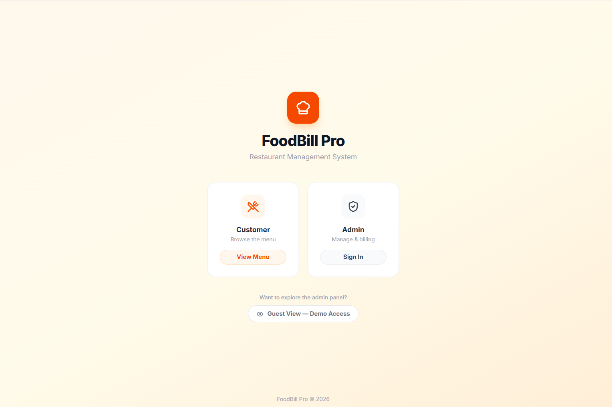
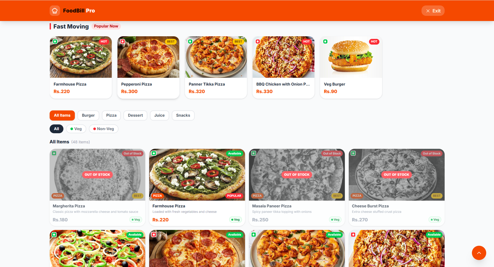
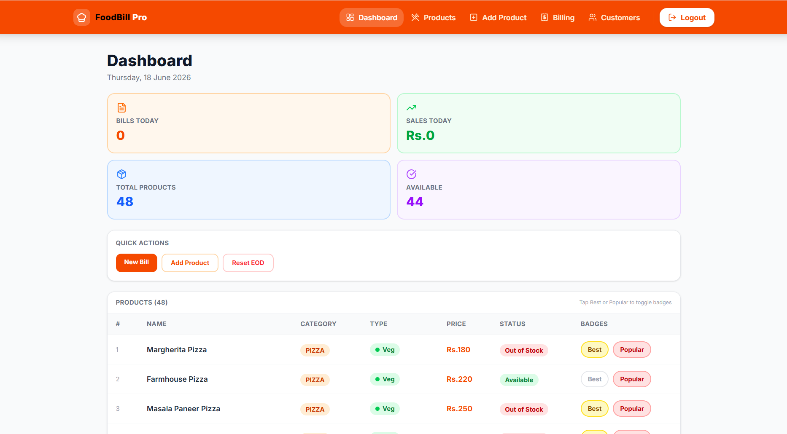
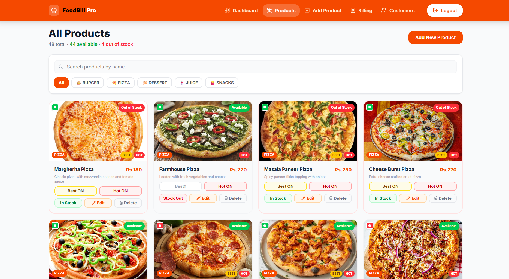
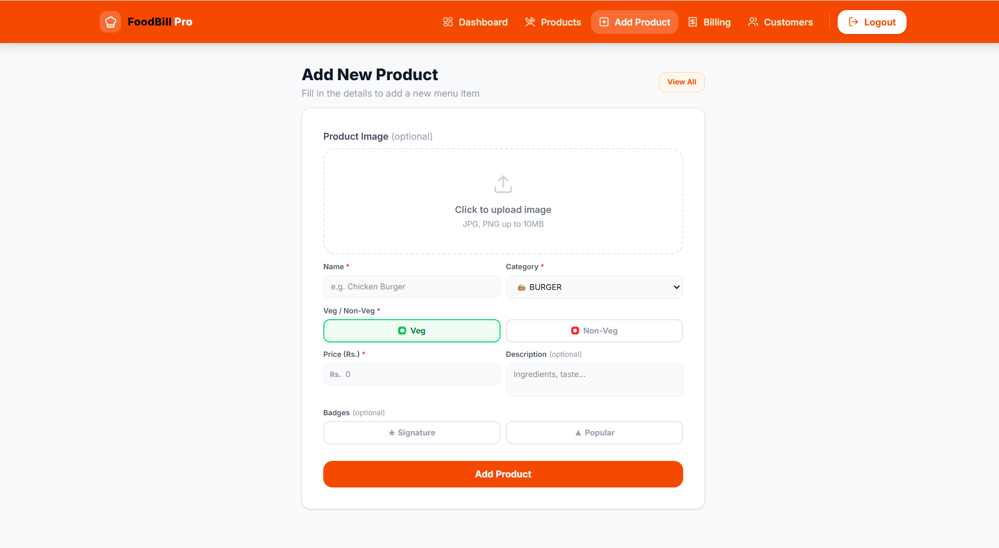
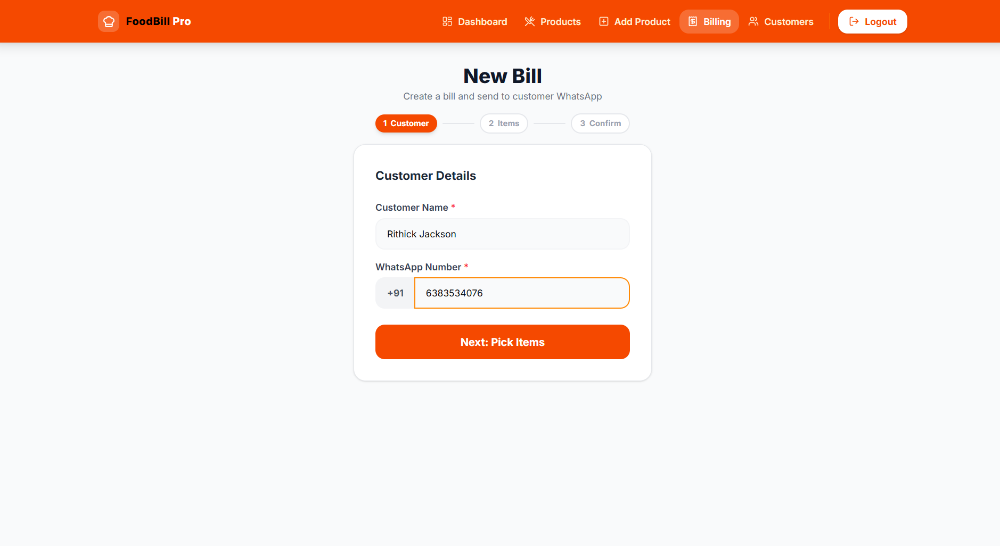
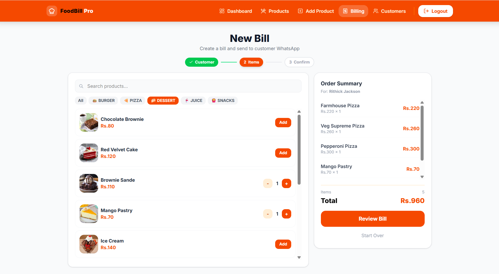
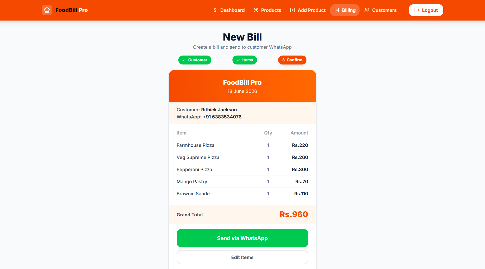
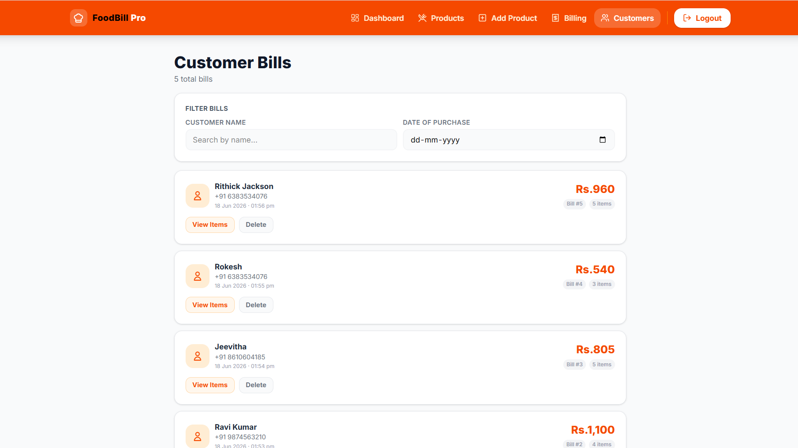

# FoodBill Pro — Digital Menu & Billing System

> A full-stack restaurant billing and menu management system built to solve a real problem observed at Domino's — customers were unaware of out-of-stock items before placing their orders.

---

[🌐 Live Demo](https://foodbillpro.netlify.app/) · [📧 Contact](mailto:rithickjacksonv@gmail.com) · [💼 LinkedIn](https://www.linkedin.com/in/rithickjackson/)

## Problem Statement

I identified a common challenge in the food service industry where customers are not aware of real-time product availability. This often leads to order modifications, longer waiting times, and customer dissatisfaction. To solve this, I developed a digital menu and billing system that provides live product availability, product images, and streamlined order management through an admin dashboard.

## Solution

FoodBill Pro is a digital menu and billing system that allows customers to view all menu items in real time — including product images, descriptions, prices, and live availability status. This eliminates the back-and-forth between customers and staff, reduces decision time, and improves the overall ordering experience.

---

## Features

### Customer Side
- Real-time digital menu with product images, descriptions and prices
- Live Available / Out of Stock status on every product
- Category filters — Burger, Pizza, Dessert, Juice, Snacks
- Veg / Non-Veg filter
- Signature Items and Fast Moving Items highlighted rows
- Responsive design — works on mobile, tablet and desktop

### Admin Side
- Secure login with JWT authentication
- Add, edit, delete and manage products
- Toggle product availability — mark as Available or Out of Stock
- Mark products as Signature (Best) or Popular for featured rows
- 3-step billing workflow — Customer Details → Pick Items → Confirm & Send
- WhatsApp bill delivery — sends formatted bill directly to customer WhatsApp
- Daily sales dashboard with total bills and total revenue
- EOD (End of Day) reset for daily summary
- Customer billing history with filter by name and date

---

## Tech Stack

| Layer | Technology |
|-------|---------|
| Frontend | React 19, Vite, Tailwind CSS v4 |
| State Management | Redux Toolkit |
| Routing | React Router v7 |
| HTTP Client | Axios |
| Icons | Lucide React |
| Notifications | Sonner |
| Backend | Spring Boot 3 |
| Security | Spring Security + JWT |
| Database | MySQL |
| ORM | JPA / Hibernate |
| Containerization | Docker |

---

## Project Structure

```
Frontend — foodbillpro-frontend/
├── src/
│   ├── api/               # Axios instance and API functions
│   ├── app/               # Redux store
│   ├── components/
│   │   ├── common/        # Spinner, ConfirmDialog, StatCard
│   │   ├── layout/        # Navbar, Layout, ScrollToTop
│   │   └── product/       # ProductCard, HorizontalCard, Skeleton
│   ├── features/          # Redux slices — auth, products, billing
│   ├── hooks/             # useAppSelector
│   ├── pages/
│   │   ├── user/          # UserMenu
│   │   └── admin/         # Dashboard, Products, Billing, Customers
│   └── router/            # ProtectedRoute

Backend — foodbillpro-backend/
├── src/main/java/com/foodbillpro/
│   ├── config/            # SecurityConfig, WebConfig
│   ├── controller/        # Auth, Product, Bill controllers
│   ├── dto/               # Request and Response DTOs
│   ├── exception/         # GlobalExceptionHandler
│   ├── model/             # Product, Bill, BillItem, DailySummary
│   ├── repository/        # JPA repositories
│   ├── security/          # JwtUtil, JwtFilter
│   └── service/           # ProductService, BillService
├── Dockerfile             # Builds the Spring Boot backend image
└── .dockerignore          # Excludes target/, .mvn/, IDE files from build context
```
---
## Key Design Decisions

- **Images stored as Base64 in MySQL** — no file system dependency, works on any deployment
- **JWT in localStorage** — simple implementation for development; production should use httpOnly cookies
- **WhatsApp via wa.me** — zero cost bill delivery without any third-party API
- **Redux Toolkit** — centralized state for cart, products and auth across all pages
- **Tailwind CSS v4** — CSS-based config, no tailwind.config.js required

---

## Containerization

- Backend (Spring Boot) is containerized with a **Dockerfile**, with a **.dockerignore** to keep the build context clean (excludes `target/`, `.mvn/`, IDE/config files, etc.)
- Frontend containerization is planned next — will follow a multi-stage build (Vite build stage → lightweight static server) to keep the image small
- A `docker-compose.yml` tying frontend, backend, and MySQL together is a planned next step once both images are ready

---

## 📸 Screenshots

| Entry                      | User Menu                              | Admin Dashboard                               |
|----------------------------|----------------------------------------|-----------------------------------------------|
|  |  |  |

| Products                              | Add Product                                | Billing 1                           |
|---------------------------------------|--------------------------------------------|-------------------------------------|
|  |  |  |

| Billing 2                           | Billing 3                           | Bills                           |
|-------------------------------------|-------------------------------------|---------------------------------|
|  |  |  |


## 📬 Contact

**Rithick Jackson**

- 🌐 [Portfolio](https://rithickjackson.netlify.app/)
- 💼 [LinkedIn](https://www.linkedin.com/in/rithickjackson/)
- 📧 [rithickjacksonv@gmail.com](mailto:rithickjacksonv@gmail.com)

---

## License

This project is open source and available under the MIT License.
